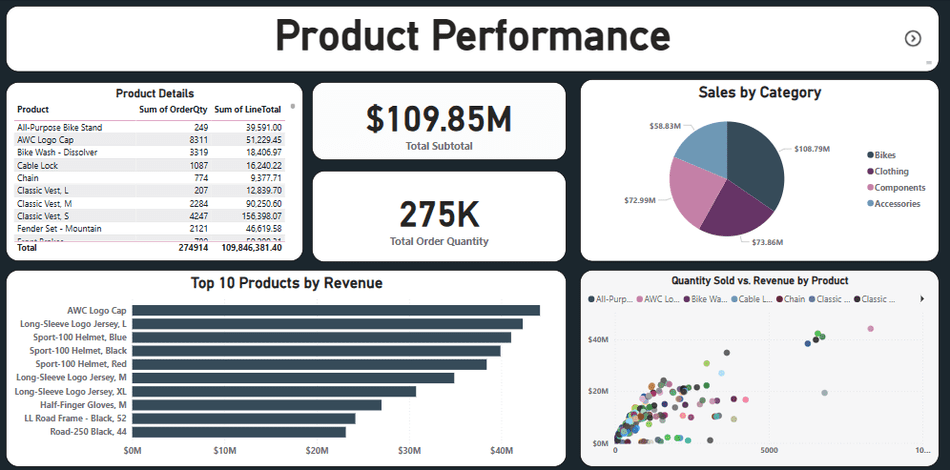
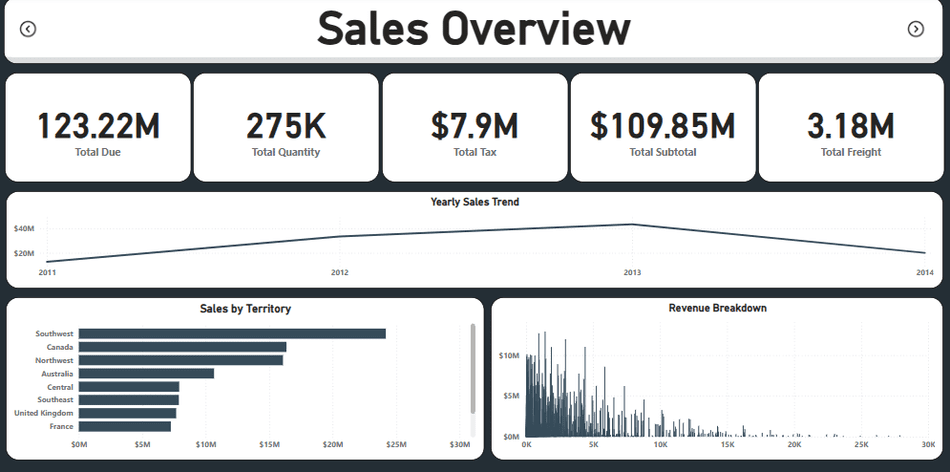
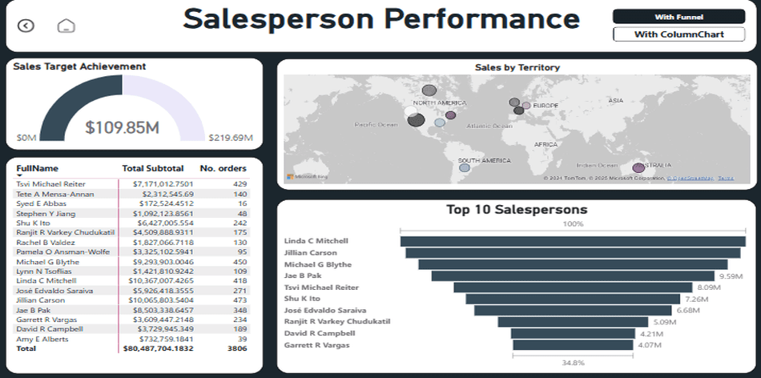

# Adventure Works 2022 Performance Report 

## 📌 Overview
This document provides a comprehensive analysis of Adventure Works' performance in 2022, focusing on **product performance**, **sales overview**, and **salesperson performance**. The data is derived from three key files:  
- 📄 **Product Performance**  
- 📄 **Sales Overview**  
- 📄 **Salesperson Performance**  

## 📂 Data Source
https://github.com/Microsoft/sql-server-samples/releases/download/adventureworks/AdventureWorks2022.bak

Let’s dive into the details! 🚀

---

## 🛠️ Product Performance

### 📊 Key Metrics
- **Total Sales by Category**: **$109.85M**  
  - 🚲 **Bikes**: $73.86M  
  - 👕 **Clothing**: $19.83M  
  - 🔧 **Components**: $10.79M  
  - 🎽 **Accessories**: $7.29M  
  - 🧰 **Other**: $5.83M  

### 🏆 Top 10 Products by Revenue
1. 🧢 **AWC Logo Cap**  
2. 👕 **Long-Sleeve Logo Jersey, L**  
3. 🚴‍♂️ **Sport-100 Helmet, Blue**  
4. 🚴‍♂️ **Sport-100 Helmet, Black**  
5. 🚴‍♂️ **Sport-100 Helmet, Red**  
6. 👕 **Long-Sleeve Logo Jersey, M**  
7. 👕 **Long-Sleeve Logo Jersey, XL**  
8. 🧤 **Half-Finger Gloves, M**  
9. 🚴‍♂️ **LL Road Frame - Black, 52**  
10. 🚴‍♂️ **Road-250 Black, 44**  

### 🔍 Insights
- 🚲 **Bikes** are the highest revenue-generating category, contributing significantly to the total sales.  
- The top 10 products include a mix of **apparel** and **safety gear**, indicating a balanced product portfolio.  

🖼️ 
  
---

## 💰 Sales Overview

### 📊 Key Metrics
- **Total Due**: **$123.22M**  
- **Total Quantity Sold**: **3.18M**  
- **Total Tax**: **$7.9M**  
- **Total Subtotal**: **$109.85M**  
- **Total Freight**: **$275K**  

### 📈 Yearly Sales Trend
- Sales have shown a **consistent upward trend** from 2011 to 2014, with a significant increase in 2014.  

### 🌍 Revenue Breakdown by Territory
- **Southeast**: $10M  
- **Canada**: $15M  
- **Northwest**: $20M  
- **Australia**: $25M  
- **Central**: $30M  
- **United Kingdom**: $10M  
- **France**: $15M  

### 🔍 Insights
- The **Central** territory generates the highest revenue, followed by **Australia** and **Northwest**.  
- The consistent yearly sales growth indicates a **strong market presence** and **effective sales strategies**.  

🖼️ 

---

## 👩‍💼 Salesperson Performance

### 📊 Key Metrics
- **Total Sales**: **$80,487,704.18**  
- **Total Orders**: **3,806**  
- **Achievement Rate**: **34.8%**  

### 🏆 Top 10 Salespersons
1. **Michael G Blythe**: $9,293,903.00 (450 orders)  
2. **Linda C Mitchell**: $10,367,007.26 (418 orders)  
3. **Jillian Carson**: $10,065,803.54 (473 orders)  
4. **Shu K Ito**: $6,427,005.55 (242 orders)  
5. **José Edvaldo Saraiva**: $5,962,818.35 (271 orders)  
6. **Ranjit R Varkey Chudukatil**: $4,500,888.93 (175 orders)  
7. **David R Campbell**: $3,729,945.34 (189 orders)  
8. **Garrett R Vargas**: $3,000,447.21 (224 orders)  
9. **Rachel B Valdez**: $1,827,065.77 (130 orders)  
10. **Jae B Pak**: $8,503,338.64 (348 orders)  

### 🔍 Insights
- **Michael G Blythe** is the top-performing salesperson, contributing significantly to the total sales.  
- The achievement rate of **34.8%** suggests room for improvement in meeting sales targets.  

- 🖼️ 

---

## 🎯 Conclusion

Adventure Works has demonstrated **strong performance** in 2022, with significant contributions from the **Bikes category** and **top-performing salespersons**. However, there is potential to enhance sales strategies to improve the overall achievement rate and further boost revenue.  

Let’s aim higher in 2025! 🚀  
